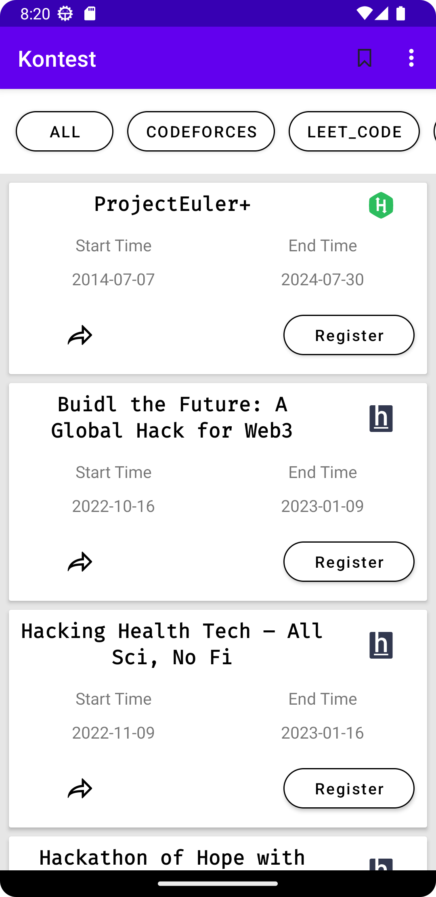
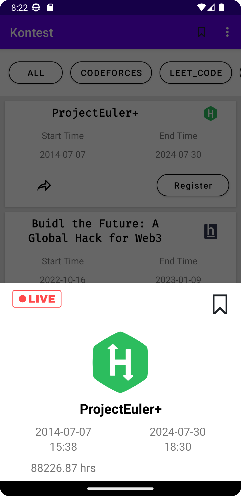
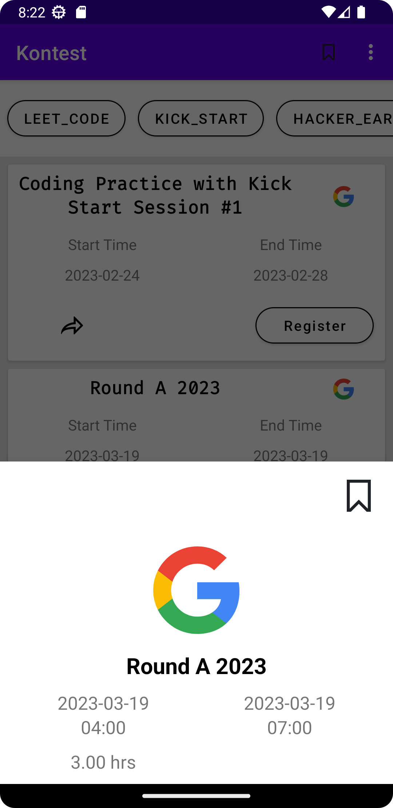
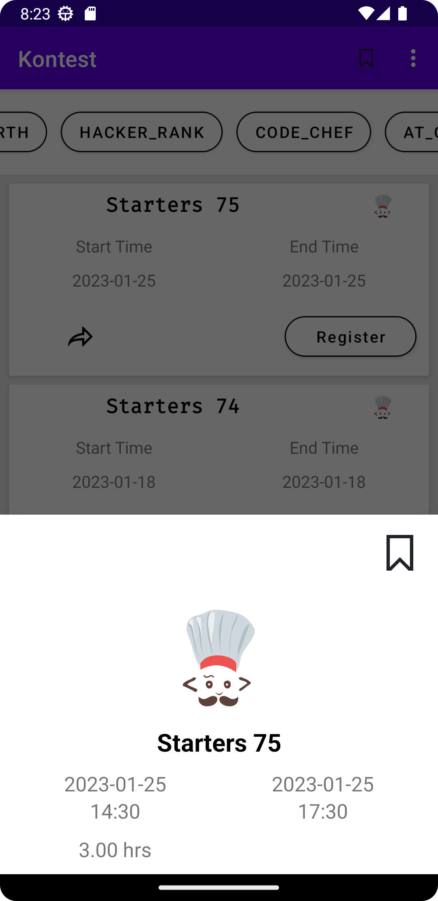
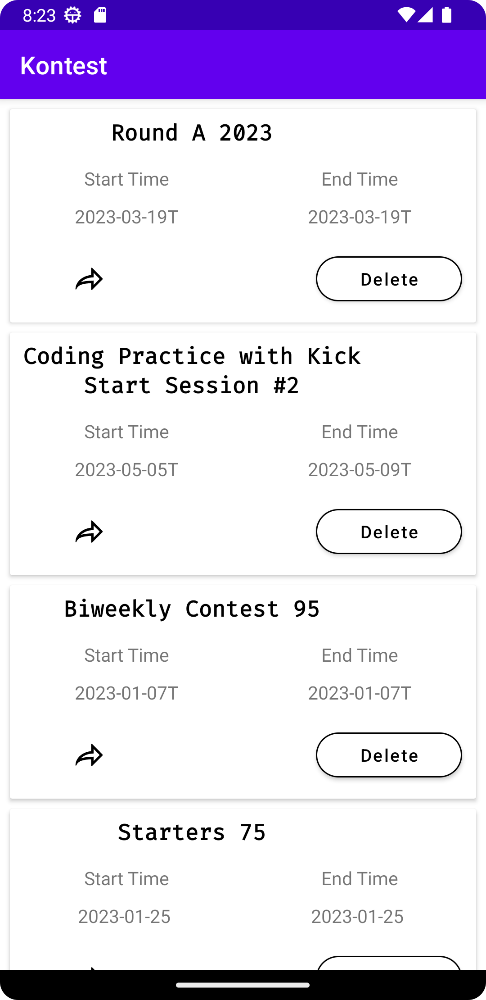

# Introduction

Hello Everyone <strong>Kontest</strong> is an Android Application for Competive programmers to see which contest is going on different platforms or which contest will be held on which date all platforms in one application.

<a href="https://www.android.com/">Android Docs</a>
<br>
<a href="https://github.com/abhinav3254/Contest-Android
">Kontest</a>

https://github.com/abhinav3254/Contest-Android


## Technologies

1. <a href="https://www.android.com/">Android</a>
1. <a href="https://www.android.com/">Java</a>
1. <a href="https://www.android.com/">XML</a>
1. <a href="https://www.android.com/">API</a>


## Authors

- [@abhinav3254](https://www.github.com/abhinav3254)


## Features

- Light/dark mode toggle
- All Platform Data at one place

## snapshots

 






## API Reference

#### Get all items

```http
  GET /all
```

| Parameter | Type     | Description                |
| :-------- | :------- | :------------------------- |
| `api_key` | `string` | **NOT Required**. |

#### Get item

```http
  GET /${name}
```

| Parameter | Type     | Description                       |
| :-------- | :------- | :-------------------------------- |
| `name`      | `string` | **Required**. name of platform to fetch |


## Appendix
To download this application go to Releases 1v1.0.0

Application size is only 6 Mb.


## Badges

Add badges from somewhere like: [shields.io](https://shields.io/)

[](https://choosealicense.com/licenses/mit/)
[](https://opensource.org/licenses/)
[](http://www.gnu.org/licenses/agpl-3.0)


## License

[MIT](https://choosealicense.com/licenses/mit/)
[](https://choosealicense.com/licenses/mit/)

## Contributing
Contributions are what make the open source community such an amazing place to learn, inspire, and create. Any contributions you make are greatly appreciated.

If you have a suggestion that would make this better, please fork the repo and create a pull request. You can also simply open an issue with the tag "enhancement". Don't forget to give the project a star! Thanks again!

1. Fork the Project
2. Create your Feature Branch (git checkout -b feature/2. AmazingFeature)
3. Commit your Changes (git commit -m 'Add some AmazingFeature')
4. Push to the Branch (git push origin feature/AmazingFeature)
5. Open a Pull Request